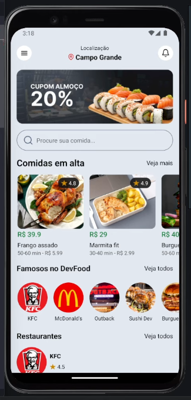

# 🛵 **DevFood (React Native)**

Este projeto é um aplicativo de delivery simples, desenvolvido com **React Native** e **Expo**. Ele simula uma vitrine de restaurantes e comidas em alta, com seções para pesquisa e navegação.

---

## 🚀 **Funcionalidades**

### **Front-End**

- Exibição de **comidas em alta** e **restaurantes populares**.
- Componente de **pesquisa** funcional.
- Lista vertical de restaurantes.
- Interface moderna com **Tailwind CSS para React Native** (NativeWind).

---

## 🛠️ **Tecnologias Utilizadas**

- **React Native**: Framework para desenvolvimento mobile.
- **Expo**: Ferramenta para simplificar o desenvolvimento e testes.
- **NativeWind**: Tailwind CSS adaptado para React Native.
- **React Navigation**: Navegação entre telas.
- **JSON Server**: Simulação de API local para dados mockados.

---

## 🔧 **Como o Sistema Funciona**

1. **Home Page**: Apresenta banner, barra de busca e seções dinâmicas.
2. **Seções**: "Comidas em alta", "Famosos no DevFood" e "Restaurantes", com ações associadas.
3. **Mock de Dados**: Os dados podem ser servidos por meio do JSON Server durante o desenvolvimento.

---

## 📋 **Requisitos**

- **Node.js** e **npm** ou **yarn** instalados.
- **Expo CLI**:
  ```bash
  npm install -g expo-cli
  ```

---


## 🔧 **Como Configurar o Projeto**

<br>
<div align="center">
  
</div>
<br>

1. Clone este repositório:

   ```bash
   git clone https://github.com/Vinicius-Rodriguess/devfood-app.git
   cd devfood-app
   ```

2. Instale as dependências:

   ```bash
   npm install
   ```

3. Inicie o projeto com Expo:

   ```bash
   npx expo start
   ```

4. Use o aplicativo Expo Go para visualizar no celular, ou o emulador configurado.

---

## 💾 **Exemplo de Uso**

- Acesse o app e veja as seções de comidas e restaurantes.
- Use o campo de busca para explorar os itens.
- Toque nos botões "Veja mais" para interações adicionais.

---

## ✅ **Melhorias Futuras**

- Integração com banco de dados real e API externa.
- Sistema de login/autenticação de usuários.
- Tela de detalhes para restaurantes e produtos.
- Funcionalidade de pedidos e carrinho.

---

## 👨‍💻 **Autor**

**Vinicius Rodrigues**

- GitHub: [Vinicius-Rodriguess](https://github.com/Vinicius-Rodriguess)
- Email: rodrigues.vini.2004@gmail.com
